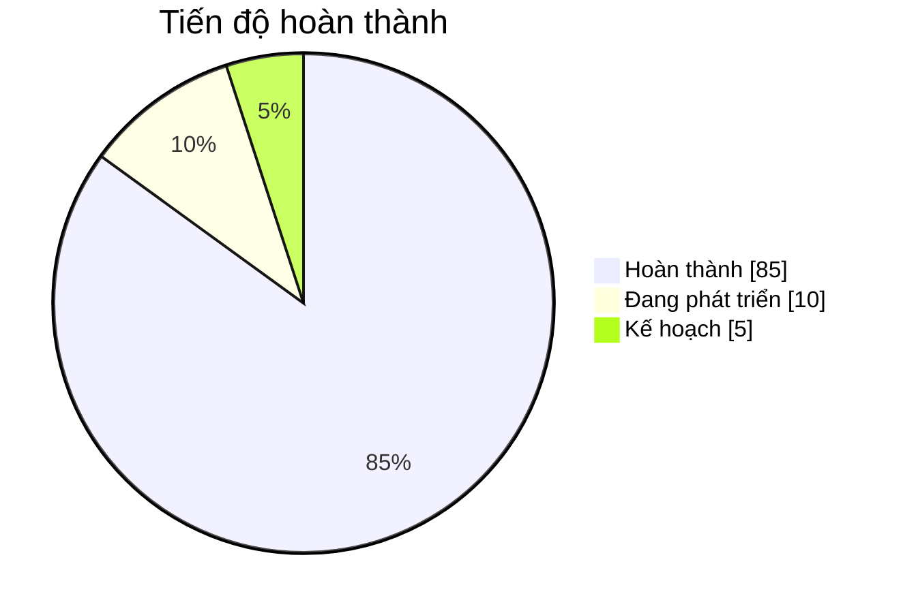

# Magic English - Ứng dụng học tiếng Anh

Ứng dụng học tiếng Anh toàn diện với AI, hỗ trợ luyện thi TOEIC, IELTS, học từ vựng, kiểm tra ngữ pháp và theo dõi tiến độ học tập.

## 🏗️ Cấu trúc thư mục dự án

```
BTL/
├── Backend/                          # Backend Spring Boot
│   └── magic-english/
│       └── src/main/java/vn/project/magic_english/
│           ├── MagicEnglishApplication.java    # Entry point
│           ├── config/                          # Cấu hình (Security, CORS, AI...)
│           ├── controller/                      # REST API Controllers
│           ├── model/                           # Entity models (User, TOEIC, IELTS...)
│           ├── repository/                      # JPA Repositories
│           ├── service/                         # Business logic services
│           └── utils/                           # Utilities (Security, Error handling)
│
├── Frontend-Moblie/                  # Flutter Mobile App
│   └── magic_enlish/
│       └── lib/
│           ├── main.dart                        # Entry point
│           ├── core/                            # Core utilities
│           │   ├── constants/                   # App constants
│           │   ├── theme/                       # Theme configuration
│           │   ├── utils/                       # Helper utilities
│           │   └── widgets/                     # Reusable widgets
│           ├── data/                            # Data layer
│           │   ├── models/                      # Data models
│           │   ├── repositories/                # Data repositories
│           │   └── services/                    # API services
│           ├── features/                        # Feature modules
│           │   ├── auth/                        # Authentication (Login, Register)
│           │   ├── grammar_checker/             # AI Grammar checking
│           │   ├── home/                        # Home dashboard
│           │   ├── news/                        # English news
│           │   ├── onboarding/                  # Onboarding screens
│           │   ├── practice/                    # TOEIC & IELTS practice
│           │   ├── profile/                     # User profile & settings
│           │   ├── progress/                    # Learning progress tracking
│           │   └── vocabulary/                  # Vocabulary learning
│           └── providers/                       # State management providers
│
├── Frontend-Web/                     # Web Frontend (nếu có)
│
├── docs/                             # Tài liệu dự án
│
└── README.md                         # File này
```

## 🚀 Tính năng chính

- **Luyện thi TOEIC**: Part 1-7, Listening & Reading với AI tạo đề
- **Luyện thi IELTS**: Writing Task 1 & 2, đánh giá bằng AI
- **Học từ vựng**: Flashcards, phát âm, ví dụ
- **Kiểm tra ngữ pháp**: AI phân tích và sửa lỗi
- **Theo dõi tiến độ**: Biểu đồ, thống kê học tập
- **Tin tức tiếng Anh**: Đọc tin để cải thiện kỹ năng

## 🛠️ Công nghệ sử dụng

### Backend

- Java 17 + Spring Boot 3
- Spring Security + JWT
- Spring Data JPA + PostgreSQL
- Gemini AI API (text generation)
- Cloudinary (media storage)

### Frontend Mobile

- Flutter 3.x + Dart
- Provider (state management)
- Dio + HTTP (API calls)
- AudioPlayers (audio playback)
- Cached Network Image

## 📦 Cài đặt

### Backend

```bash
cd Backend/magic-english
./mvnw spring-boot:run
```

### Frontend Mobile

```bash
cd Frontend-Moblie/magic_enlish
flutter pub get
flutter run
```

### Build APK

```bash
flutter build apk --release
copy build\app\outputs\flutter-apk\app-release.apk MagicEnglish.apk
```

## 👥 Tác giả

- **Nhóm dự án**: TryHard IT

## 📄 License

MIT License
<div align="center">

# 🪄 Magic English ✨


<br/>
<br/>


<br/>

### 📱 Ứng dụng học tiếng Anh thông minh với AI

_Nền tảng học tiếng Anh toàn diện hỗ trợ luyện thi IELTS, TOEIC và phát triển từ vựng_

<br/>

[📲 Tải App](#cài-đặt) · [📖 Tài liệu](#tính-năng-chính) · [🐛 Báo lỗi](../../issues) · [💡 Đề xuất](../../issues)

---

</div>

<br/>

## 🌟 Giới thiệu

**Magic English** là ứng dụng di động học tiếng Anh được phát triển bằng Flutter và Spring Boot, tích hợp trí tuệ nhân tạo (AI) để mang đến trải nghiệm học tập cá nhân hóa và hiệu quả.

<div align="center">

```
┌──────────────────────────────────────────────────────────────────┐
│                                                                  │
│   📱 Flutter Mobile App                                          │
│   ├── 🎨 Modern UI/UX Design                                     │
│   ├── 🌙 Dark/Light Mode                                         │
│   └── 📊 Progress Tracking                                       │
│                                                                  │
│   ⚡ Spring Boot Backend                                          │
│   ├── 🔐 Secure Authentication                                   │
│   ├── 🤖 AI Integration                                          │
│   └── 📈 Analytics & Reports                                     │
│                                                                  │
└──────────────────────────────────────────────────────────────────┘
```

</div>

<br/>

## ✨ Tính năng chính

<table>
<tr>
<td width="50%">

### 📚 Luyện thi IELTS

- 🎧 Listening Practice
- 📖 Reading Comprehension
- ✍️ Writing Tasks
- 🗣️ Speaking Exercises

</td>
<td width="50%">

### 📝 Luyện thi TOEIC

- 👂 Part 1-4: Listening
- 📄 Part 5-7: Reading
- ⏱️ Timed Practice Tests
- 📊 Score Analysis

</td>
</tr>
<tr>
<td width="50%">

### 🔤 Từ vựng thông minh

- 🃏 Flashcards tương tác
- 🔊 Phát âm chuẩn
- 📸 Nhận dạng từ vựng qua ảnh
- 🎮 Game học từ vựng

</td>
<td width="50%">

### 🤖 AI Assistant

- 💬 Chatbot hỗ trợ học tập
- ✅ Chấm bài tự động
- 📝 Gợi ý cải thiện
- 🎯 Học tập cá nhân hóa

</td>
</tr>
</table>

<br/>

## 🛠️ Công nghệ sử dụng

<div align="center">

|                                                Frontend                                                |                                                      Backend                                                       |                                                AI/ML                                                |                                                    Database                                                     |
| :----------------------------------------------------------------------------------------------------: | :----------------------------------------------------------------------------------------------------------------: | :-------------------------------------------------------------------------------------------------: | :-------------------------------------------------------------------------------------------------------------: |
|  |  |  |  |
|           |                    |  |              |

</div>

<br/>

## 📂 Cấu trúc dự án

```
📦 BTL_final/
├── 📱 Mobile/
│   └── magic_english/          # Flutter Application
│       ├── lib/                # Source code
│       ├── android/            # Android configs
│       ├── ios/                # iOS configs
│       └── pubspec.yaml        # Dependencies
│
├── ⚡ Backend/
│   ├── src/                    # Spring Boot source
│   ├── build.gradle            # Build configuration
│   ├── Dockerfile              # Docker config
│   └── docker-compose.yml      # Docker compose
│
└── 🌐 Web/                     # Web application (if any)
```

<br/>

## 🚀 Cài đặt

### Yêu cầu hệ thống

| Công cụ | Phiên bản |
| ------- | --------- |
| Flutter | >= 3.0.0  |
| Dart    | >= 3.0.0  |
| Java    | >= 17     |
| Docker  | >= 20.0   |

### Hướng dẫn cài đặt

<details>
<summary><b>📱 Mobile App (Flutter)</b></summary>

```bash
# Clone repository
git clone https://github.com/your-repo/magic-english.git

# Di chuyển vào thư mục Mobile
cd BTL_final/Mobile/magic_english

# Cài đặt dependencies
flutter pub get

# Chạy ứng dụng
flutter run
```

</details>

<details>
<summary><b>⚡ Backend (Spring Boot)</b></summary>

```bash
# Di chuyển vào thư mục Backend
cd BTL_final/Backend

# Build project
./gradlew build

# Chạy với Docker
docker-compose up -d

# Hoặc chạy trực tiếp
./gradlew bootRun
```

</details>

<br/>

---

<div align="center">

## 🎯 Team Members & Responsibilities

<br/>

<table>
<tr>
<th>👤 Thành Viên</th>
<th>🎯 Vai Trò</th>
<th>🆔 Mã Sinh Viên</th>
</tr>
<tr>
<td align="center">
<br/>
<b>Lê Minh Đức</b>
</td>
<td>
• Quản lý dự án & phân công<br/>
• Backend Architecture<br/>
• Spring Security & OAuth2<br/>
• Database Design
</td>
<td align="center"><code>2251172287</code></td>
</tr>
<tr>
<td align="center">
<br/>
<b>Nguyễn Thị Thanh Huyền</b>
</td>
<td>
• Flutter App Architecture<br/>
• UI/UX Implementation<br/>
• State Management<br/>
• Mobile Testing
</td>
<td align="center"><code>2251172379</code></td>
</tr>
<tr>
<td align="center">
<br/>
<b>Ngô Thị Thùy</b>
</td>
<td>
• Tích hợp Spring AI<br/>
• OpenAI/Gemini API<br/>
• ML Kit Text Recognition<br/>
• AI Features Development
</td>
<td align="center"><code>2251172517</code></td>
</tr>
</table>

</div>

<br/>

---

<div align="center">

## 📊 Tiến độ dự án

<br/>



</div>

<br/>

## 📄 License

<div align="center">

Dự án này được phát triển cho mục đích học tập.

<br/>

---

<br/>


**Made with ❤️ by Magic English Team**

_© 2026 - All Rights Reserved_

</div>
