# SƠ ĐỒ UML - DỰ ÁN MAGIC ENGLISH

## Ứng dụng Học Tiếng Anh Thông Minh

---

# PHẦN 1: SƠ ĐỒ USE CASE

## 1.1. Sơ đồ Use Case Tổng quan Hệ thống

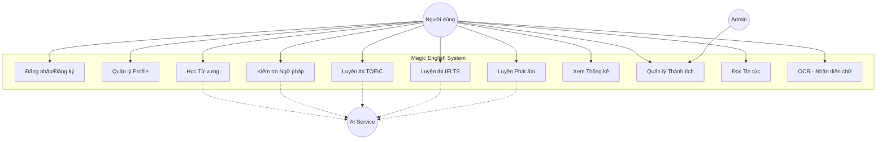
```mermaid
graph TB
    subgraph "Magic English System"
        UC1["Đăng nhập/Đăng ký"]
        UC2["Quản lý Profile"]
        UC3["Học Từ vựng"]
        UC4["Kiểm tra Ngữ pháp"]
        UC5["Luyện thi TOEIC"]
        UC6["Luyện thi IELTS"]
        UC7["Luyện Phát âm"]
        UC8["Xem Thống kê"]
        UC9["Quản lý Thành tích"]
        UC10["Đọc Tin tức"]
        UC11["OCR - Nhận diện chữ"]
    end

    User((Người dùng))
    Admin((Admin))
    AI((AI Service))

    User --> UC1
    User --> UC2
    User --> UC3
    User --> UC4
    User --> UC5
    User --> UC6
    User --> UC7
    User --> UC8
    User --> UC9
    User --> UC10
    User --> UC11

    Admin --> UC9
    
    UC3 -.-> AI
    UC4 -.-> AI
    UC5 -.-> AI
    UC6 -.-> AI
    UC7 -.-> AI
```

---

## 1.2. Sơ đồ Use Case - Module Authentication

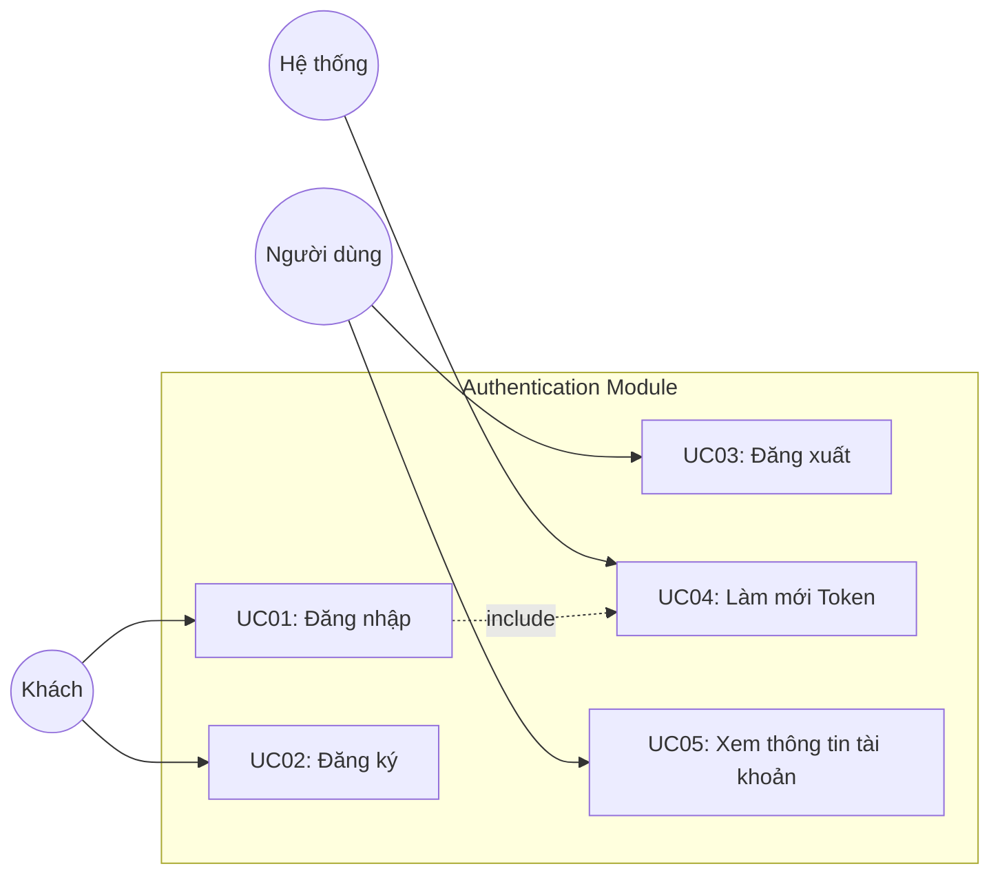
```mermaid
graph LR
    subgraph "Authentication Module"
        UC_Login["UC01: Đăng nhập"]
        UC_Register["UC02: Đăng ký"]
        UC_Logout["UC03: Đăng xuất"]
        UC_Refresh["UC04: Làm mới Token"]
        UC_Account["UC05: Xem thông tin tài khoản"]
    end

    User((Người dùng))
    Guest((Khách))
    System((Hệ thống))

    Guest --> UC_Login
    Guest --> UC_Register
    User --> UC_Logout
    User --> UC_Account
    System --> UC_Refresh

    UC_Login -.->|include| UC_Refresh
```

---

## 1.3. Sơ đồ Use Case - Module Vocabulary

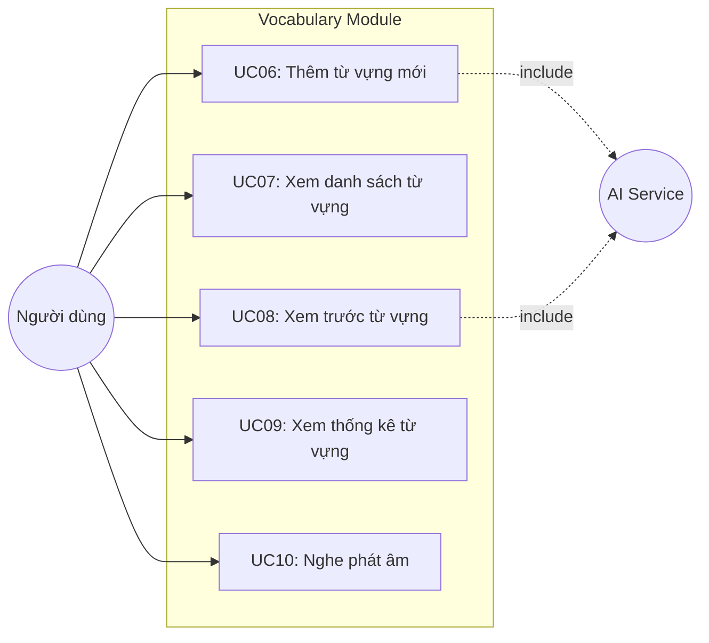
```mermaid
graph LR
    subgraph "Vocabulary Module"
        UC_Add["UC06: Thêm từ vựng mới"]
        UC_List["UC07: Xem danh sách từ vựng"]
        UC_Preview["UC08: Xem trước từ vựng"]
        UC_Stats["UC09: Xem thống kê từ vựng"]
        UC_Audio["UC10: Nghe phát âm"]
    end

    User((Người dùng))
    AI((AI Service))

    User --> UC_Add
    User --> UC_List
    User --> UC_Preview
    User --> UC_Stats
    User --> UC_Audio

    UC_Add -.->|include| AI
    UC_Preview -.->|include| AI
```

---

## 1.4. Sơ đồ Use Case - Module Grammar Checker

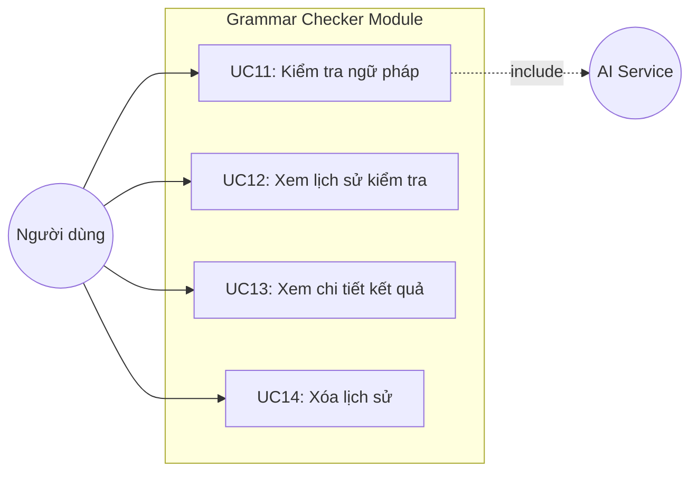
```mermaid
graph LR
    subgraph "Grammar Checker Module"
        UC_Check["UC11: Kiểm tra ngữ pháp"]
        UC_History["UC12: Xem lịch sử kiểm tra"]
        UC_Detail["UC13: Xem chi tiết kết quả"]
        UC_Delete["UC14: Xóa lịch sử"]
    end

    User((Người dùng))
    AI((AI Service))

    User --> UC_Check
    User --> UC_History
    User --> UC_Detail
    User --> UC_Delete

    UC_Check -.->|include| AI
```

---

## 1.5. Sơ đồ Use Case - Module TOEIC/IELTS Practice

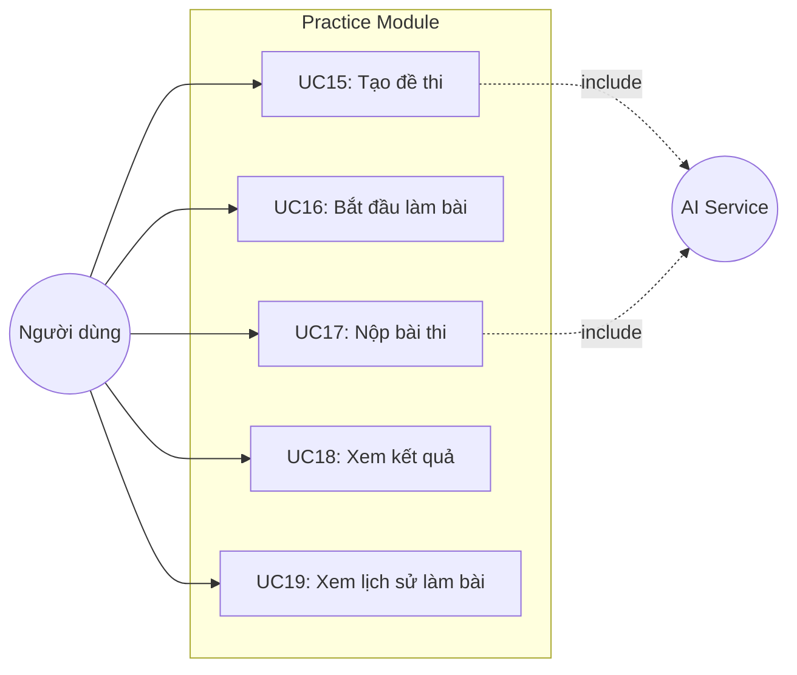
```mermaid
graph LR
    subgraph "Practice Module"
        UC_Generate["UC15: Tạo đề thi"]
        UC_Start["UC16: Bắt đầu làm bài"]
        UC_Submit["UC17: Nộp bài thi"]
        UC_Result["UC18: Xem kết quả"]
        UC_PracticeHistory["UC19: Xem lịch sử làm bài"]
    end

    User((Người dùng))
    AI((AI Service))

    User --> UC_Generate
    User --> UC_Start
    User --> UC_Submit
    User --> UC_Result
    User --> UC_PracticeHistory

    UC_Generate -.->|include| AI
    UC_Submit -.->|include| AI
```

---

## 1.6. Sơ đồ Use Case - Module Achievement

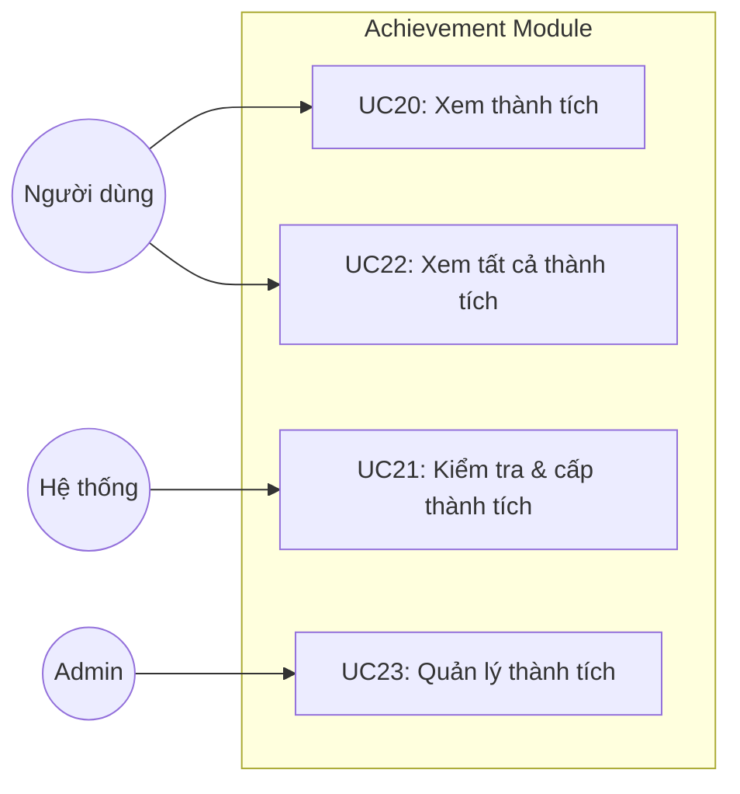
```mermaid
graph LR
    subgraph "Achievement Module"
        UC_ViewAch["UC20: Xem thành tích"]
        UC_CheckAch["UC21: Kiểm tra & cấp thành tích"]
        UC_AllAch["UC22: Xem tất cả thành tích"]
        UC_ManageAch["UC23: Quản lý thành tích"]
    end

    User((Người dùng))
    Admin((Admin))
    System((Hệ thống))

    User --> UC_ViewAch
    User --> UC_AllAch
    System --> UC_CheckAch
    Admin --> UC_ManageAch
```

---

# PHẦN 2: BIỂU ĐỒ HOẠT ĐỘNG (ACTIVITY DIAGRAM)

## 2.1. Biểu đồ hoạt động - Chức năng Đăng nhập

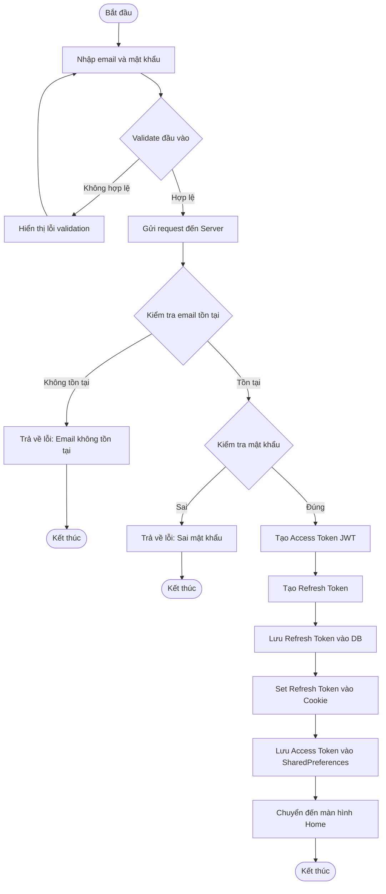
```mermaid
flowchart TD
    Start([Bắt đầu]) --> A[Nhập email và mật khẩu]
    A --> B{Validate đầu vào}
    B -->|Không hợp lệ| C[Hiển thị lỗi validation]
    C --> A
    B -->|Hợp lệ| D[Gửi request đến Server]
    D --> E{Kiểm tra email tồn tại}
    E -->|Không tồn tại| F[Trả về lỗi: Email không tồn tại]
    F --> End1([Kết thúc])
    E -->|Tồn tại| G{Kiểm tra mật khẩu}
    G -->|Sai| H[Trả về lỗi: Sai mật khẩu]
    H --> End2([Kết thúc])
    G -->|Đúng| I[Tạo Access Token JWT]
    I --> J[Tạo Refresh Token]
    J --> K[Lưu Refresh Token vào DB]
    K --> L[Set Refresh Token vào Cookie]
    L --> M[Lưu Access Token vào SharedPreferences]
    M --> N[Chuyển đến màn hình Home]
    N --> End3([Kết thúc])
```

---

## 2.2. Biểu đồ hoạt động - Chức năng Đăng ký

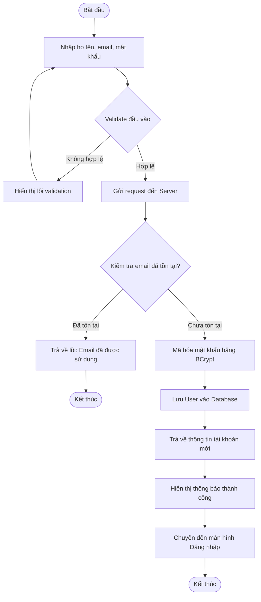
```mermaid
flowchart TD
    Start([Bắt đầu]) --> A[Nhập họ tên, email, mật khẩu]
    A --> B{Validate đầu vào}
    B -->|Không hợp lệ| C[Hiển thị lỗi validation]
    C --> A
    B -->|Hợp lệ| D[Gửi request đến Server]
    D --> E{Kiểm tra email đã tồn tại?}
    E -->|Đã tồn tại| F[Trả về lỗi: Email đã được sử dụng]
    F --> End1([Kết thúc])
    E -->|Chưa tồn tại| G[Mã hóa mật khẩu bằng BCrypt]
    G --> H[Lưu User vào Database]
    H --> I[Trả về thông tin tài khoản mới]
    I --> J[Hiển thị thông báo thành công]
    J --> K[Chuyển đến màn hình Đăng nhập]
    K --> End2([Kết thúc])
```

---

## 2.3. Biểu đồ hoạt động - Chức năng Thêm từ vựng

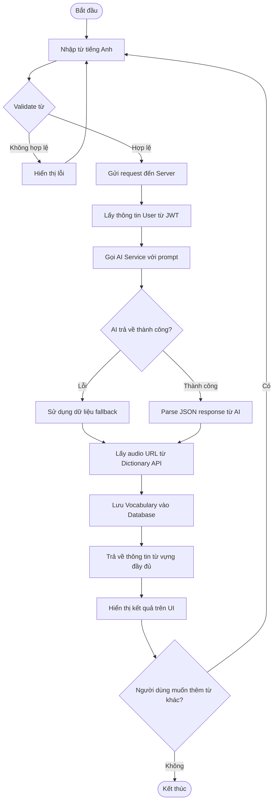
```mermaid
flowchart TD
    Start([Bắt đầu]) --> A[Nhập từ tiếng Anh]
    A --> B{Validate từ}
    B -->|Không hợp lệ| C[Hiển thị lỗi]
    C --> A
    B -->|Hợp lệ| D[Gửi request đến Server]
    D --> E[Lấy thông tin User từ JWT]
    E --> F[Gọi AI Service với prompt]
    F --> G{AI trả về thành công?}
    G -->|Lỗi| H[Sử dụng dữ liệu fallback]
    G -->|Thành công| I[Parse JSON response từ AI]
    H --> J
    I --> J[Lấy audio URL từ Dictionary API]
    J --> K[Lưu Vocabulary vào Database]
    K --> L[Trả về thông tin từ vựng đầy đủ]
    L --> M[Hiển thị kết quả trên UI]
    M --> N{Người dùng muốn thêm từ khác?}
    N -->|Có| A
    N -->|Không| End([Kết thúc])
```

---

## 2.4. Biểu đồ hoạt động - Chức năng Kiểm tra Ngữ pháp

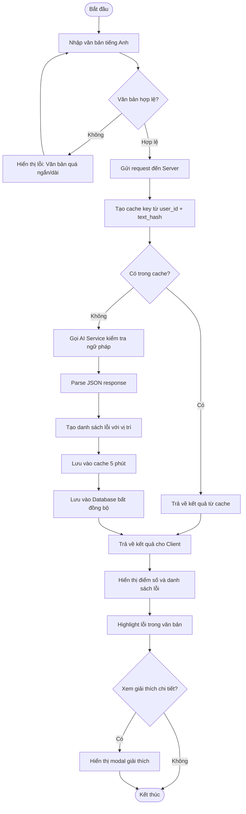
```mermaid
flowchart TD
    Start([Bắt đầu]) --> A[Nhập văn bản tiếng Anh]
    A --> B{Văn bản hợp lệ?}
    B -->|Không| C[Hiển thị lỗi: Văn bản quá ngắn/dài]
    C --> A
    B -->|Hợp lệ| D[Gửi request đến Server]
    D --> E[Tạo cache key từ user_id + text_hash]
    E --> F{Có trong cache?}
    F -->|Có| G[Trả về kết quả từ cache]
    F -->|Không| H[Gọi AI Service kiểm tra ngữ pháp]
    H --> I[Parse JSON response]
    I --> J[Tạo danh sách lỗi với vị trí]
    J --> K[Lưu vào cache 5 phút]
    K --> L[Lưu vào Database bất đồng bộ]
    G --> M
    L --> M[Trả về kết quả cho Client]
    M --> N[Hiển thị điểm số và danh sách lỗi]
    N --> O[Highlight lỗi trong văn bản]
    O --> P{Xem giải thích chi tiết?}
    P -->|Có| Q[Hiển thị modal giải thích]
    P -->|Không| End([Kết thúc])
    Q --> End
```

---

## 2.5. Biểu đồ hoạt động - Chức năng Làm bài thi TOEIC

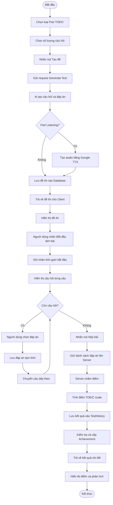
```mermaid
flowchart TD
    Start([Bắt đầu]) --> A[Chọn loại Part TOEIC]
    A --> B[Chọn số lượng câu hỏi]
    B --> C[Nhấn nút Tạo đề]
    C --> D[Gửi request Generate Test]
    D --> E[AI tạo câu hỏi và đáp án]
    E --> F{Part Listening?}
    F -->|Có| G[Tạo audio bằng Google TTS]
    F -->|Không| H
    G --> H[Lưu đề thi vào Database]
    H --> I[Trả về đề thi cho Client]
    I --> J[Hiển thị đề thi]
    J --> K[Người dùng nhấn Bắt đầu làm bài]
    K --> L[Ghi nhận thời gian bắt đầu]
    L --> M[Hiển thị câu hỏi từng câu]
    M --> N{Còn câu hỏi?}
    N -->|Có| O[Người dùng chọn đáp án]
    O --> P[Lưu đáp án tạm thời]
    P --> Q[Chuyển câu tiếp theo]
    Q --> N
    N -->|Không| R[Nhấn nút Nộp bài]
    R --> S[Gửi danh sách đáp án lên Server]
    S --> T[Server chấm điểm]
    T --> U[Tính điểm TOEIC scale]
    U --> V[Lưu kết quả vào TestHistory]
    V --> W[Kiểm tra và cấp Achievement]
    W --> X[Trả về kết quả chi tiết]
    X --> Y[Hiển thị điểm và phân tích]
    Y --> End([Kết thúc])
```

---

## 2.6. Biểu đồ hoạt động - Chức năng Luyện Phát âm

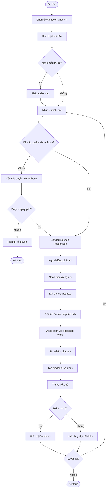
```mermaid
flowchart TD
    Start([Bắt đầu]) --> A[Chọn từ cần luyện phát âm]
    A --> B[Hiển thị từ và IPA]
    B --> C{Nghe mẫu trước?}
    C -->|Có| D[Phát audio mẫu]
    D --> E
    C -->|Không| E[Nhấn nút Ghi âm]
    E --> F{Đã cấp quyền Microphone?}
    F -->|Chưa| G[Yêu cầu quyền Microphone]
    G --> H{Được cấp quyền?}
    H -->|Không| I[Hiển thị lỗi quyền]
    I --> End1([Kết thúc])
    H -->|Có| J
    F -->|Rồi| J[Bắt đầu Speech Recognition]
    J --> K[Người dùng phát âm]
    K --> L[Nhận diện giọng nói]
    L --> M[Lấy transcribed text]
    M --> N[Gửi lên Server để phân tích]
    N --> O[AI so sánh với expected word]
    O --> P[Tính điểm phát âm]
    P --> Q[Tạo feedback và gợi ý]
    Q --> R[Trả về kết quả]
    R --> S{Điểm >= 80?}
    S -->|Có| T[Hiển thị Excellent!]
    S -->|Không| U[Hiển thị gợi ý cải thiện]
    T --> V{Luyện lại?}
    U --> V
    V -->|Có| E
    V -->|Không| End2([Kết thúc])
```

---

## 2.7. Biểu đồ hoạt động - Chức năng OCR (Nhận diện chữ từ ảnh)

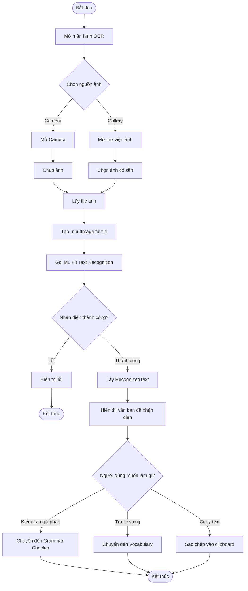
```mermaid
flowchart TD
    Start([Bắt đầu]) --> A[Mở màn hình OCR]
    A --> B{Chọn nguồn ảnh}
    B -->|Camera| C[Mở Camera]
    B -->|Gallery| D[Mở thư viện ảnh]
    C --> E[Chụp ảnh]
    D --> F[Chọn ảnh có sẵn]
    E --> G[Lấy file ảnh]
    F --> G
    G --> H[Tạo InputImage từ file]
    H --> I[Gọi ML Kit Text Recognition]
    I --> J{Nhận diện thành công?}
    J -->|Lỗi| K[Hiển thị lỗi]
    K --> End1([Kết thúc])
    J -->|Thành công| L[Lấy RecognizedText]
    L --> M[Hiển thị văn bản đã nhận diện]
    M --> N{Người dùng muốn làm gì?}
    N -->|Kiểm tra ngữ pháp| O[Chuyển đến Grammar Checker]
    N -->|Tra từ vựng| P[Chuyển đến Vocabulary]
    N -->|Copy text| Q[Sao chép vào clipboard]
    O --> End2([Kết thúc])
    P --> End2
    Q --> End2
```

---

## 2.8. Biểu đồ hoạt động - Kiểm tra và cấp Thành tích

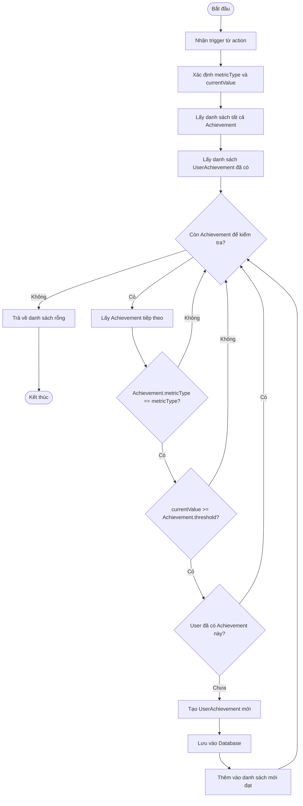
```mermaid
flowchart TD
    Start([Bắt đầu]) --> A[Nhận trigger từ action]
    A --> B[Xác định metricType và currentValue]
    B --> C[Lấy danh sách tất cả Achievement]
    C --> D[Lấy danh sách UserAchievement đã có]
    D --> E{Còn Achievement để kiểm tra?}
    E -->|Không| F[Trả về danh sách rỗng]
    F --> End1([Kết thúc])
    E -->|Có| G[Lấy Achievement tiếp theo]
    G --> H{Achievement.metricType == metricType?}
    H -->|Không| E
    H -->|Có| I{currentValue >= Achievement.threshold?}
    I -->|Không| E
    I -->|Có| J{User đã có Achievement này?}
    J -->|Có| E
    J -->|Chưa| K[Tạo UserAchievement mới]
    K --> L[Lưu vào Database]
    L --> M[Thêm vào danh sách mới đạt]
    M --> E
```

---

# PHẦN 3: BIỂU ĐỒ TUẦN TỰ (SEQUENCE DIAGRAM)

## 3.1. Biểu đồ tuần tự - Đăng nhập

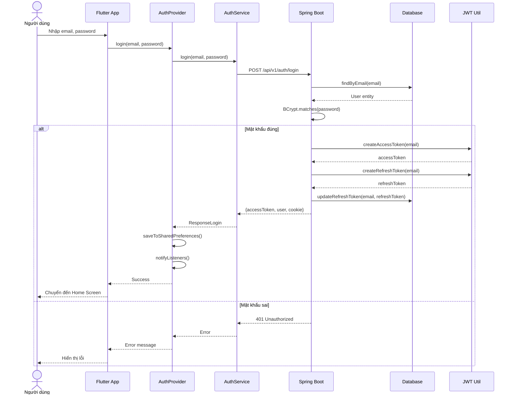
```mermaid
sequenceDiagram
    actor User as Người dùng
    participant App as Flutter App
    participant Auth as AuthProvider
    participant API as AuthService
    participant Backend as Spring Boot
    participant DB as Database
    participant JWT as JWT Util

    User->>App: Nhập email, password
    App->>Auth: login(email, password)
    Auth->>API: login(email, password)
    API->>Backend: POST /api/v1/auth/login
    Backend->>DB: findByEmail(email)
    DB-->>Backend: User entity
    Backend->>Backend: BCrypt.matches(password)
    alt Mật khẩu đúng
        Backend->>JWT: createAccessToken(email)
        JWT-->>Backend: accessToken
        Backend->>JWT: createRefreshToken(email)
        JWT-->>Backend: refreshToken
        Backend->>DB: updateRefreshToken(email, refreshToken)
        Backend-->>API: {accessToken, user, cookie}
        API-->>Auth: ResponseLogin
        Auth->>Auth: saveToSharedPreferences()
        Auth->>Auth: notifyListeners()
        Auth-->>App: Success
        App-->>User: Chuyển đến Home Screen
    else Mật khẩu sai
        Backend-->>API: 401 Unauthorized
        API-->>Auth: Error
        Auth-->>App: Error message
        App-->>User: Hiển thị lỗi
    end
```

---

## 3.2. Biểu đồ tuần tự - Đăng ký

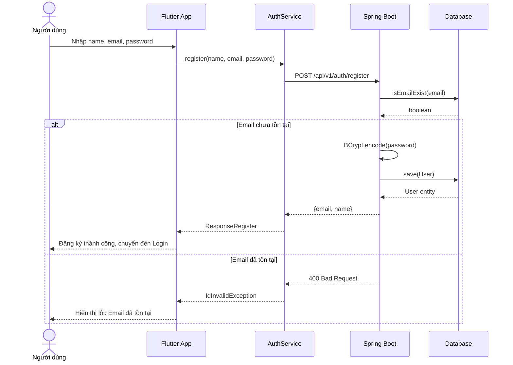
```mermaid
sequenceDiagram
    actor User as Người dùng
    participant App as Flutter App
    participant API as AuthService
    participant Backend as Spring Boot
    participant DB as Database

    User->>App: Nhập name, email, password
    App->>API: register(name, email, password)
    API->>Backend: POST /api/v1/auth/register
    Backend->>DB: isEmailExist(email)
    DB-->>Backend: boolean
    alt Email chưa tồn tại
        Backend->>Backend: BCrypt.encode(password)
        Backend->>DB: save(User)
        DB-->>Backend: User entity
        Backend-->>API: {email, name}
        API-->>App: ResponseRegister
        App-->>User: Đăng ký thành công, chuyển đến Login
    else Email đã tồn tại
        Backend-->>API: 400 Bad Request
        API-->>App: IdInvalidException
        App-->>User: Hiển thị lỗi: Email đã tồn tại
    end
```

---

## 3.3. Biểu đồ tuần tự - Thêm từ vựng với AI

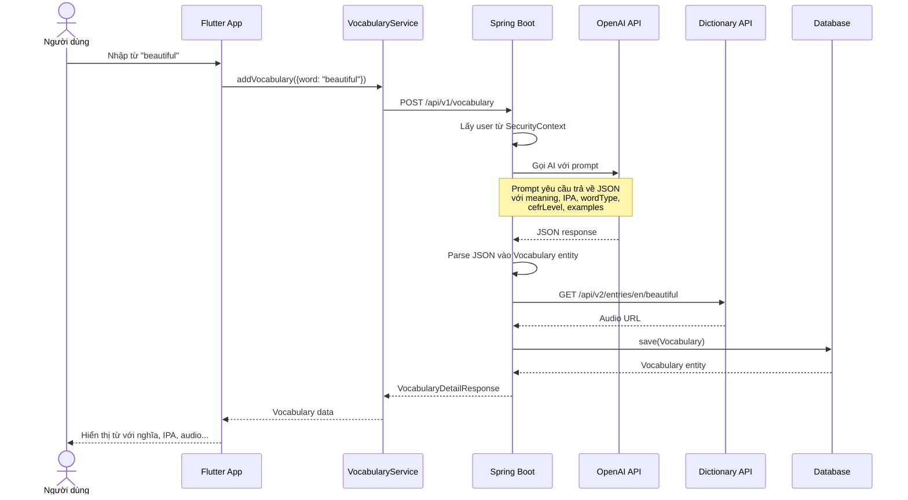
```mermaid
sequenceDiagram
    actor User as Người dùng
    participant App as Flutter App
    participant API as VocabularyService
    participant Backend as Spring Boot
    participant AI as OpenAI API
    participant Dict as Dictionary API
    participant DB as Database

    User->>App: Nhập từ "beautiful"
    App->>API: addVocabulary({word: "beautiful"})
    API->>Backend: POST /api/v1/vocabulary
    Backend->>Backend: Lấy user từ SecurityContext
    Backend->>AI: Gọi AI với prompt
    Note over Backend,AI: Prompt yêu cầu trả về JSON<br/>với meaning, IPA, wordType,<br/>cefrLevel, examples
    AI-->>Backend: JSON response
    Backend->>Backend: Parse JSON vào Vocabulary entity
    Backend->>Dict: GET /api/v2/entries/en/beautiful
    Dict-->>Backend: Audio URL
    Backend->>DB: save(Vocabulary)
    DB-->>Backend: Vocabulary entity
    Backend-->>API: VocabularyDetailResponse
    API-->>App: Vocabulary data
    App-->>User: Hiển thị từ với nghĩa, IPA, audio...
```

---

## 3.4. Biểu đồ tuần tự - Kiểm tra Ngữ pháp

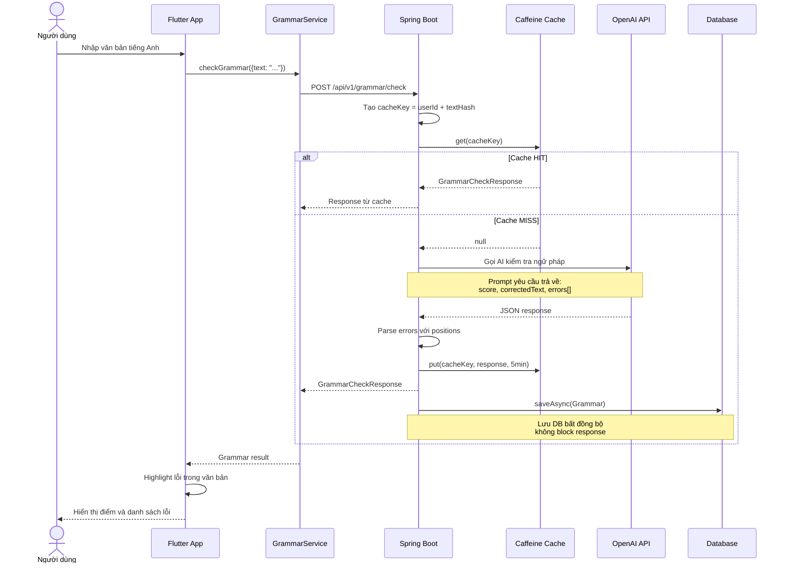
```mermaid
sequenceDiagram
    actor User as Người dùng
    participant App as Flutter App
    participant API as GrammarService
    participant Backend as Spring Boot
    participant Cache as Caffeine Cache
    participant AI as OpenAI API
    participant DB as Database

    User->>App: Nhập văn bản tiếng Anh
    App->>API: checkGrammar({text: "..."})
    API->>Backend: POST /api/v1/grammar/check
    Backend->>Backend: Tạo cacheKey = userId + textHash
    Backend->>Cache: get(cacheKey)
    alt Cache HIT
        Cache-->>Backend: GrammarCheckResponse
        Backend-->>API: Response từ cache
    else Cache MISS
        Cache-->>Backend: null
        Backend->>AI: Gọi AI kiểm tra ngữ pháp
        Note over Backend,AI: Prompt yêu cầu trả về:<br/>score, correctedText, errors[]
        AI-->>Backend: JSON response
        Backend->>Backend: Parse errors với positions
        Backend->>Cache: put(cacheKey, response, 5min)
        Backend-->>API: GrammarCheckResponse
        Backend->>DB: saveAsync(Grammar)
        Note over Backend,DB: Lưu DB bất đồng bộ<br/>không block response
    end
    API-->>App: Grammar result
    App->>App: Highlight lỗi trong văn bản
    App-->>User: Hiển thị điểm và danh sách lỗi
```

---

## 3.5. Biểu đồ tuần tự - Làm bài thi TOEIC

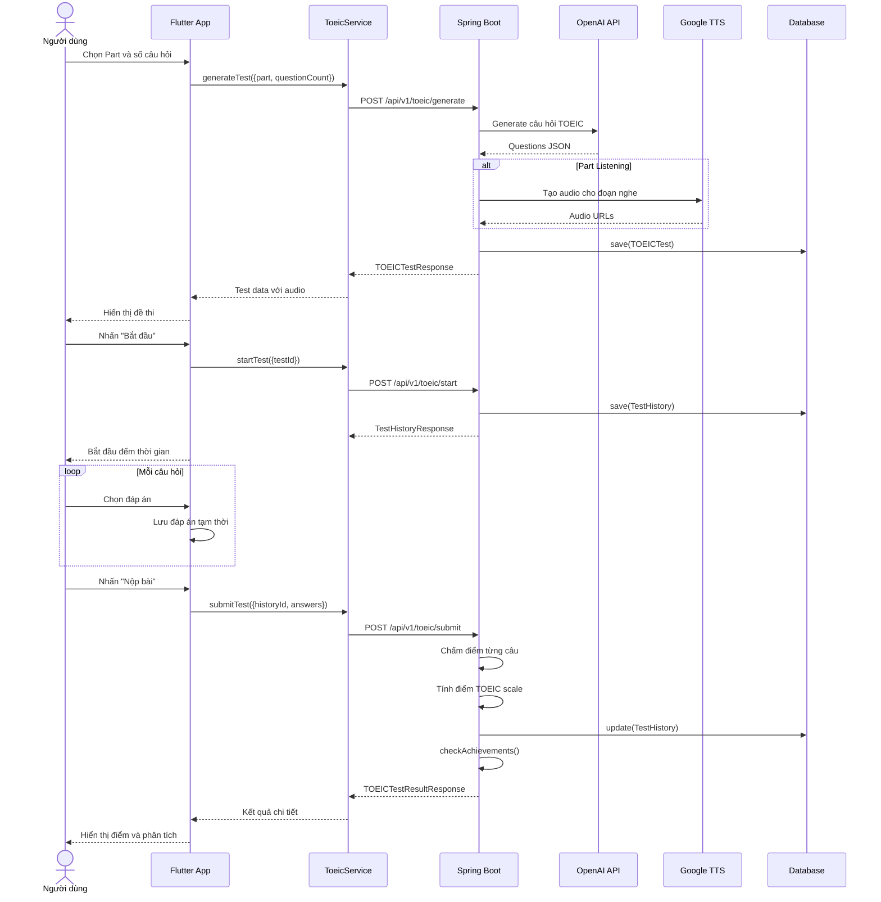
```mermaid
sequenceDiagram
    actor User as Người dùng
    participant App as Flutter App
    participant API as ToeicService
    participant Backend as Spring Boot
    participant AI as OpenAI API
    participant TTS as Google TTS
    participant DB as Database

    User->>App: Chọn Part và số câu hỏi
    App->>API: generateTest({part, questionCount})
    API->>Backend: POST /api/v1/toeic/generate
    Backend->>AI: Generate câu hỏi TOEIC
    AI-->>Backend: Questions JSON
    alt Part Listening
        Backend->>TTS: Tạo audio cho đoạn nghe
        TTS-->>Backend: Audio URLs
    end
    Backend->>DB: save(TOEICTest)
    Backend-->>API: TOEICTestResponse
    API-->>App: Test data với audio
    App-->>User: Hiển thị đề thi

    User->>App: Nhấn "Bắt đầu"
    App->>API: startTest({testId})
    API->>Backend: POST /api/v1/toeic/start
    Backend->>DB: save(TestHistory)
    Backend-->>API: TestHistoryResponse
    App-->>User: Bắt đầu đếm thời gian

    loop Mỗi câu hỏi
        User->>App: Chọn đáp án
        App->>App: Lưu đáp án tạm thời
    end

    User->>App: Nhấn "Nộp bài"
    App->>API: submitTest({historyId, answers})
    API->>Backend: POST /api/v1/toeic/submit
    Backend->>Backend: Chấm điểm từng câu
    Backend->>Backend: Tính điểm TOEIC scale
    Backend->>DB: update(TestHistory)
    Backend->>Backend: checkAchievements()
    Backend-->>API: TOEICTestResultResponse
    API-->>App: Kết quả chi tiết
    App-->>User: Hiển thị điểm và phân tích
```

---

## 3.6. Biểu đồ tuần tự - Luyện Phát âm

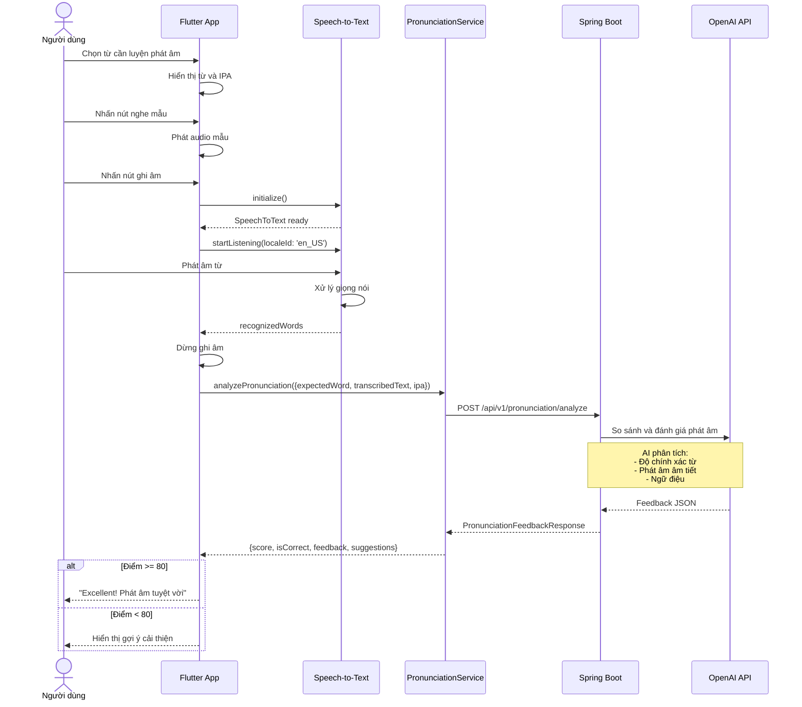
```mermaid
sequenceDiagram
    actor User as Người dùng
    participant App as Flutter App
    participant Speech as Speech-to-Text
    participant API as PronunciationService
    participant Backend as Spring Boot
    participant AI as OpenAI API

    User->>App: Chọn từ cần luyện phát âm
    App->>App: Hiển thị từ và IPA
    User->>App: Nhấn nút nghe mẫu
    App->>App: Phát audio mẫu

    User->>App: Nhấn nút ghi âm
    App->>Speech: initialize()
    Speech-->>App: SpeechToText ready
    App->>Speech: startListening(localeId: 'en_US')
    User->>Speech: Phát âm từ
    Speech->>Speech: Xử lý giọng nói
    Speech-->>App: recognizedWords
    App->>App: Dừng ghi âm

    App->>API: analyzePronunciation({expectedWord, transcribedText, ipa})
    API->>Backend: POST /api/v1/pronunciation/analyze
    Backend->>AI: So sánh và đánh giá phát âm
    Note over Backend,AI: AI phân tích:<br/>- Độ chính xác từ<br/>- Phát âm âm tiết<br/>- Ngữ điệu
    AI-->>Backend: Feedback JSON
    Backend-->>API: PronunciationFeedbackResponse
    API-->>App: {score, isCorrect, feedback, suggestions}
    
    alt Điểm >= 80
        App-->>User: "Excellent! Phát âm tuyệt vời"
    else Điểm < 80
        App-->>User: Hiển thị gợi ý cải thiện
    end
```

---

## 3.7. Biểu đồ tuần tự - OCR (Nhận diện chữ từ ảnh)

```mermaid
sequenceDiagram
    actor User as Người dùng
    participant App as Flutter App
    participant Camera as Image Picker
    participant MLKit as Google ML Kit
    participant Grammar as Grammar Service

    User->>App: Mở tính năng OCR
    App->>Camera: Yêu cầu chọn ảnh
    alt Từ Camera
        Camera->>Camera: Mở Camera
        User->>Camera: Chụp ảnh
        Camera-->>App: XFile (image)
    else Từ Gallery
        Camera->>Camera: Mở thư viện ảnh
        User->>Camera: Chọn ảnh
        Camera-->>App: XFile (image)
    end

    App->>MLKit: TextRecognizer.processImage(inputImage)
    MLKit->>MLKit: Xử lý ảnh
    MLKit-->>App: RecognizedText
    App->>App: Lấy text từ RecognizedText.text
    App-->>User: Hiển thị văn bản đã nhận diện

    opt Người dùng chọn kiểm tra ngữ pháp
        User->>App: Nhấn "Kiểm tra ngữ pháp"
        App->>Grammar: checkGrammar(recognizedText)
        Grammar-->>App: Grammar result
        App-->>User: Hiển thị kết quả kiểm tra
    end
```

---

## 3.8. Biểu đồ tuần tự - Làm mới Access Token

```mermaid
sequenceDiagram
    participant App as Flutter App
    participant API as API Service
    participant Backend as Spring Boot
    participant JWT as JWT Util
    participant DB as Database

    Note over App: Access Token hết hạn
    App->>API: Bất kỳ request nào
    API->>Backend: Request với expired token
    Backend-->>API: 401 Unauthorized
    
    API->>Backend: GET /api/v1/auth/refresh
    Note over API,Backend: Refresh token trong Cookie
    Backend->>Backend: Đọc refresh_token từ Cookie
    Backend->>JWT: Verify refresh token
    
    alt Token hợp lệ
        JWT-->>Backend: Claims (email, ...)
        Backend->>DB: findByEmailAndRefreshToken()
        DB-->>Backend: User entity
        Backend->>JWT: createAccessToken(email)
        JWT-->>Backend: New accessToken
        Backend->>JWT: createRefreshToken(email)
        JWT-->>Backend: New refreshToken
        Backend->>DB: updateRefreshToken()
        Backend-->>API: {accessToken, refreshToken}
        API->>API: Cập nhật SharedPreferences
        API->>Backend: Retry request gốc với token mới
        Backend-->>API: Response thành công
    else Token không hợp lệ
        Backend-->>API: 401 Invalid refresh token
        API->>App: Redirect đến Login
    end
```

---

## 3.9. Biểu đồ tuần tự - Kiểm tra và cấp Thành tích

```mermaid
sequenceDiagram
    actor System as Hệ thống
    participant Backend as Spring Boot
    participant AchService as AchievementService
    participant DB as Database
    participant App as Flutter App
    actor User as Người dùng

    Note over System: Sau khi user hoàn thành action<br/>(học từ, làm bài thi, ...)
    
    System->>Backend: checkAchievements(metricType, currentValue)
    Backend->>AchService: checkAndGrantAchievements(user, metricType, value)
    AchService->>DB: findAll(Achievement)
    DB-->>AchService: List[Achievement]
    AchService->>DB: findByUserId(UserAchievement)
    DB-->>AchService: List[UserAchievement]
    
    loop Mỗi Achievement
        AchService->>AchService: Check metricType match
        AchService->>AchService: Check value >= threshold
        AchService->>AchService: Check chưa có UserAchievement
        alt Đạt điều kiện mới
            AchService->>DB: save(UserAchievement)
            AchService->>AchService: Thêm vào newlyUnlocked
        end
    end
    
    AchService-->>Backend: List[newlyUnlockedAchievements]
    Backend-->>App: Achievement notification
    
    alt Có thành tích mới
        App->>App: Hiển thị popup chúc mừng
        App-->>User: "Chúc mừng! Bạn đã đạt thành tích X"
    end
```

---

## 3.10. Biểu đồ tuần tự - Upload Avatar

```mermaid
sequenceDiagram
    actor User as Người dùng
    participant App as Flutter App
    participant Picker as Image Picker
    participant API as FileService
    participant Backend as Spring Boot
    participant Cloud as Cloudinary/Storage
    participant DB as Database

    User->>App: Nhấn đổi avatar
    App->>Picker: pickImage(source: gallery/camera)
    Picker-->>App: XFile (image)
    App->>App: Hiển thị preview ảnh

    User->>App: Xác nhận đổi avatar
    App->>API: uploadFile(file, folder: "avatar")
    API->>Backend: POST /api/v1/files (multipart/form-data)
    Backend->>Backend: Validate file extension
    Backend->>Backend: Generate unique filename
    Backend->>Cloud: Upload file
    Cloud-->>Backend: File URL
    Backend-->>API: {fileName, uploadedAt}
    
    API->>Backend: PUT /api/v1/users (update avatarUrl)
    Backend->>DB: update(User.avatarUrl)
    DB-->>Backend: Updated User
    Backend-->>API: ResUpdateUser
    API-->>App: Success
    App->>App: Cập nhật UI với avatar mới
    App-->>User: Avatar đã được cập nhật
```

---

# PHẦN 4: TỔNG HỢP

## Bảng tổng hợp số lượng sơ đồ

| Loại sơ đồ       | Số lượng | Mô tả                         |
| ---------------- | -------- | ----------------------------- |
| Use Case Diagram | 6        | Tổng quan + 5 module chi tiết |
| Activity Diagram | 8        | Các luồng xử lý chính         |
| Sequence Diagram | 10       | Tương tác giữa các thành phần |

## Các Actor chính trong hệ thống

| Actor                 | Vai trò                 | Quyền hạn                        |
| --------------------- | ----------------------- | -------------------------------- |
| **Khách (Guest)**     | Người chưa đăng nhập    | Đăng ký, Đăng nhập               |
| **Người dùng (User)** | Người dùng đã đăng nhập | Tất cả chức năng học tập         |
| **Admin**             | Quản trị viên           | Quản lý Achievement, User        |
| **Hệ thống (System)** | Xử lý tự động           | Refresh token, Check achievement |
| **AI Service**        | OpenAI API              | Xử lý NLP, kiểm tra ngữ pháp     |

---

> **Ghi chú**: Tất cả các sơ đồ đều sử dụng cú pháp Mermaid và có thể được render trong các công cụ hỗ trợ như GitHub, GitLab, VS Code với extension Mermaid, hoặc các công cụ online như mermaid.live
